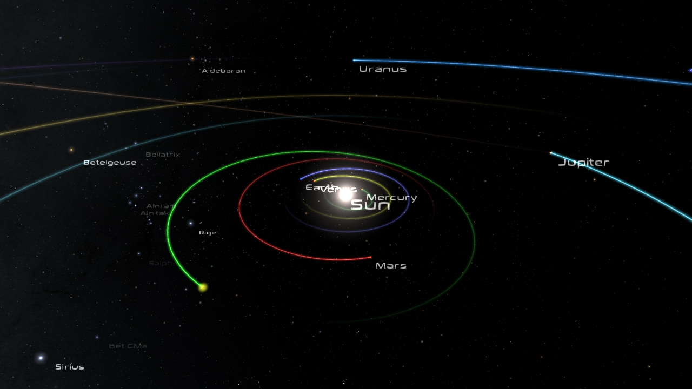

# lugduna-gaiasky
Visualize the orbit of the asteroid 1133 Lugduna with GaiaSky. This video was made in connection with the [Leiden
European City of Science 2022](https://leiden2022.nl/) events.

Many thanks to [Toni Sagristà Sellés](https://tonisagrista.com/) for helping me figure out how to create this GaiaSky
animation.



## How to reproduce the video

### GaiaSky setup
* Install [GaiaSky](https://zah.uni-heidelberg.de/gaia/outreach/gaiasky)
* Run GaiaSky first to configure it properly for reproducing the video:
    * Make sure that the Hipparcos data set is installed (in addition to the base data set
    * Run GaiaSky and change the GUI _Graphics settings_ to _windowed mode_ with a size of 1280x720 pixels
* Exit GaiaSky

### GaiaSky config files
* To use PNG output frames edit `~/.xdg/gaiasky/config.yaml` and change the "JPG" occurences to "PNG"
    * This step is only needed after the first time running GaiaSky
* Copy the file `orbit-lugduna.json` from the `gsfiles` folder to `~/.local/share/gaiasky/data/default-data/`
* Copy the file `dataset.json` from the `gsfiles` folder to `~/.local/share/gaiasky/data/default-data/`, replacing the existing `dataset.json`
* Edit `~/gaiasky/conf/config.yaml` and change "pointCloud: POINTS" to "pointCloud: TRIANGLES" (assuming your hardware can handle this).

### Create the video
* Start GaiaSky and while GaiaSky is running execute the following instruction from the command line:
```cli
python lugduna.py -s
```
* Generate the video by running (can be done without GaiaSky running):
```cli
./makevideo.sh [-e] [-n]
```
* The output videos can be found in the `video` folder.

If you modify anything you can see what the animation sequence looks like by running `python lugduna.py` without the
`-s` switch. This will be faster (no frames are stored from GaiaSky) but the explanations and Lugduna and date labels
will be missing (these are added with the `makevideo.sh` script).

## Dependencies
* [NumPy](https://numpy.org/)
* [py4j](https://www.py4j.org/)
* [pygaia](https://pypi.org/project/PyGaia/)
* [FFmpeg](https://ffmpeg.org/)
